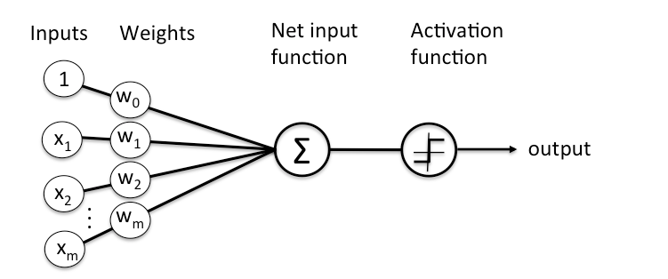

# Simple-Neural-Network-Algorithm-Python

A simple python program that implements Neural Network Algorithm to perform classification using feed forward and back propagation passes on small test data set

## What is Aritificial Neural Network?
An ANN is based on a collection of connected units or nodes called artificial neurons, which loosely model the neurons in a biological brain. Each connection, like the synapses in a biological brain, can transmit a signal to other neurons. An artificial neuron that receives a signal then processes it and can signal neurons connected to it.

Here’s a diagram of what one node might look like.

# Pre-requisites
## Anaconda Python & Jupyter Notebook

One must have Python installed in his local system. Use jupyter notebook to run this script.   
[Download Anaconda here](https://www.anaconda.com/products/individual)  
